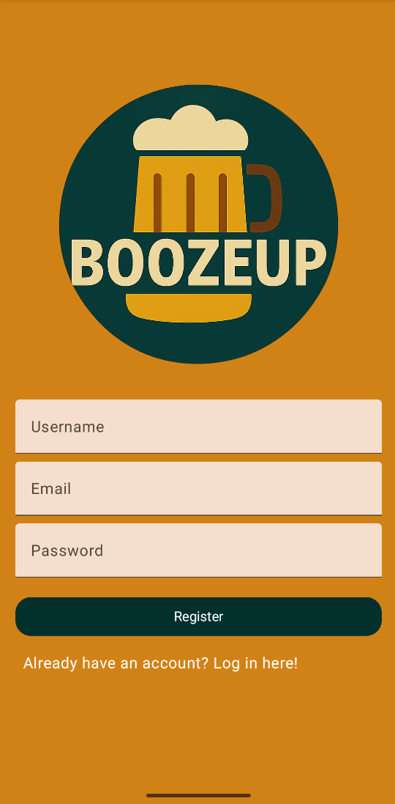
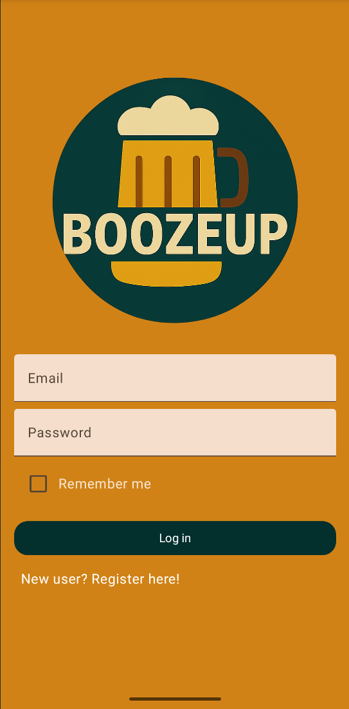
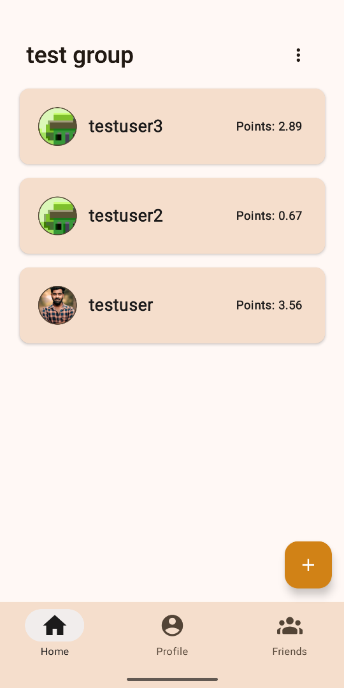
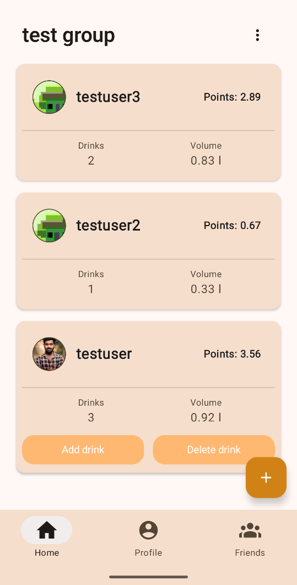
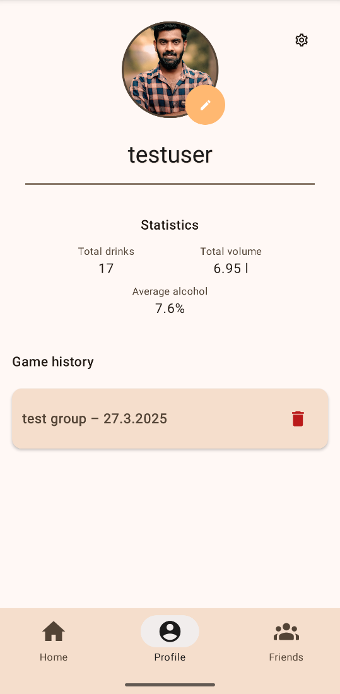
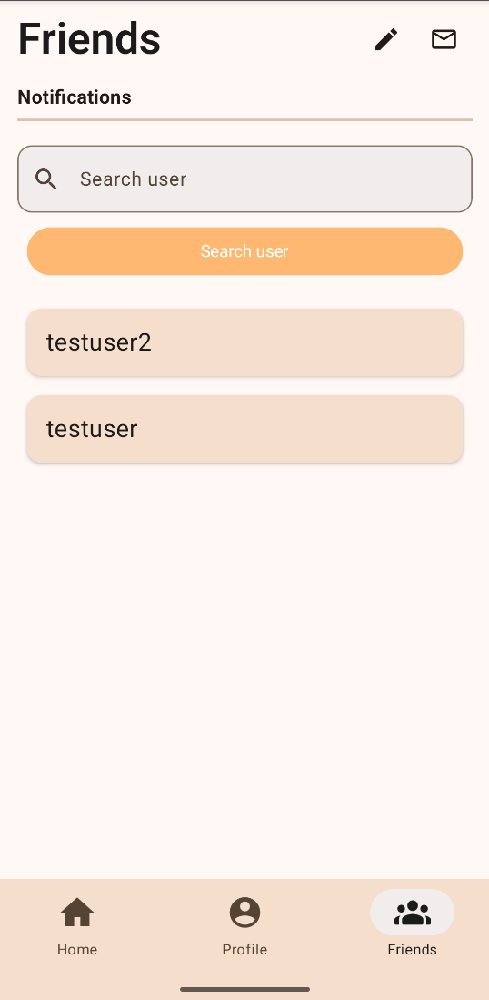
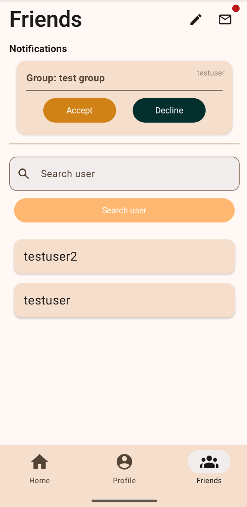

# 🍻 BoozeUP

**BoozeUP** is a real-time drink tracking app. Build your own social circle and compete together!

---

## 🔑 Features

- User authentication with Firebase (email/password)
- Drink counter – add, edit or remove drinks with calculated points
- Automatic point system based on drink volume and alcohol percentage
- Groups – create a group, invite friends, and drink together
- Leaderboard – real-time comparison of users' drinking stats within a group
- Friend system – send and receive friend requests, search users by username
- Profile picture upload using Firebase Storage
- Notifications – view group invitations and friend requests in one place
- Game history – save up to 3 completed games with points and photos
- Localization support – English (default) and Finnish (🇬🇧 / 🇫🇮)
- Dark/light theme – Material Theme Builder compatible
- Realtime updates using Firebase Realtime Database

---

## 📸 Preview screenshots

###  Authentication

  
  

---

### Home View

  
  

---

###  Profile & Stats

---

###  Friends & Invites

  
  

---

---

##  Project Summary

BoozeUP was designed to solve a fun, yet technically rich problem: enabling real-time group-based drink tracking during social gatherings.

Using Firebase for:
- real-time updates (Realtime Database),
- user authentication (Firebase Auth),
- image handling (Firebase Storage),

...and Jetpack Compose for:
- building a modern and reactive UI,

BoozeUP demonstrates a full-stack mobile architecture with clean state management and modular components.

