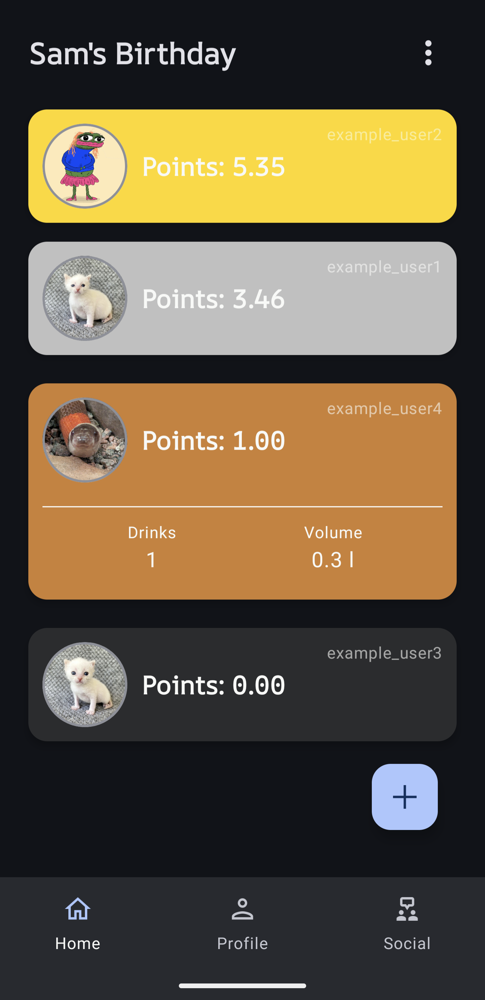
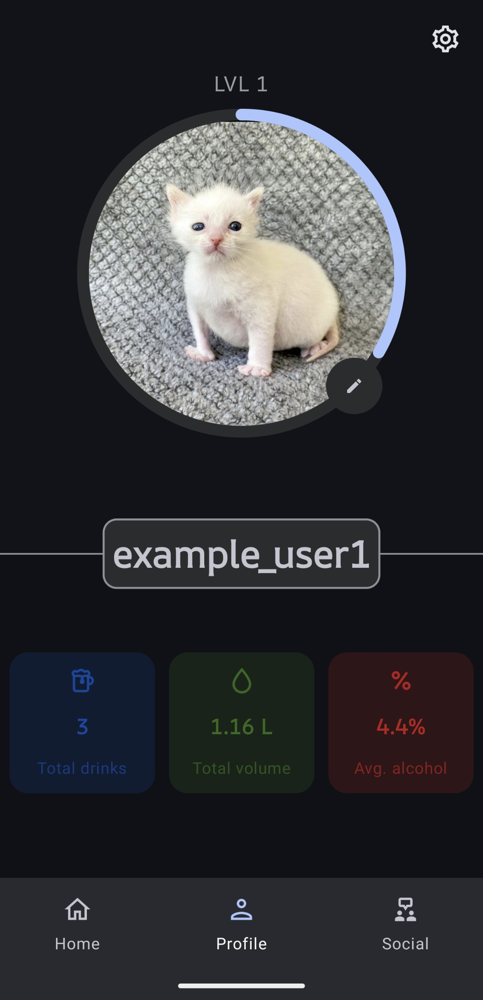
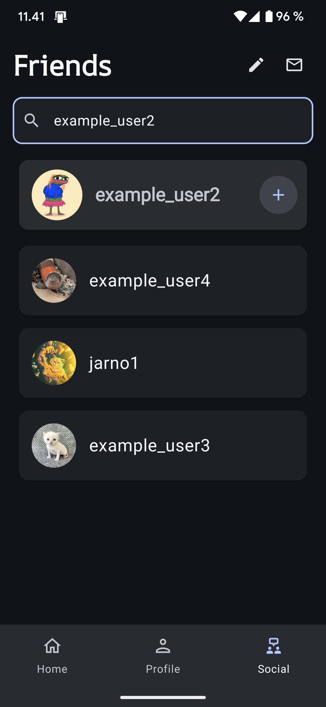
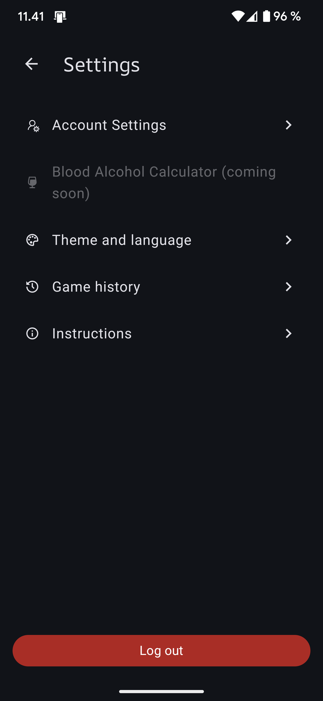
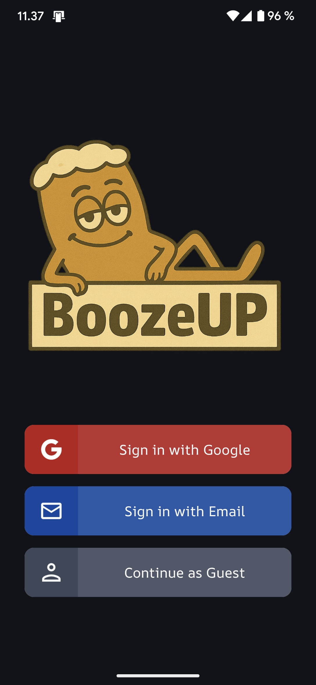

# BoozeUP 🍻 

BoozeUP is a social drinking game app where you can create groups, track your drinks, compete with friends, and view your drinking history — all in real time!
(Android only for now, iOS support coming soon!)

## About the App

The idea behind BoozeUP is to make social drinking more interactive and fun. Create groups, track your dricks, gain points, and compete on leaderboards. Players can upload pictures, gain XP, and view their game history and statistics afterwards.

## Features

- ✅ **Create or join groups** with your friends
- ✅ **Alcohol counter** to track your drinks and alcohol level
- ✅ **Unique points system** to gain points and climb up the leaderboard
- ✅ **Photo taking** to create a shared photo album
- ✅ **Advanced Admin tools** to ensure smooth gameplay
- ✅ **Friend system** to build a social circle
- ✅ **XP system** (daily login, games, new friends)
- ✅ **Blood Alcohol Calculator** (coming soon)
- ✅ **Track your statistics** over long period of time
- ✅ **Game history** with dedicated photo albums
- ✅ **Theme & language settings** (Light & Dark theme, EN/FI support)
- ✅ **Secure Firebase Authentication** (Anonymous, Email and Google login)

## Screenshots

| HomeScreen (Leaderboard) | Profile (Statistics) | Social (Friends & Invites) | Settings (Themes, Language, Account) | Login Screen |
| :----------------------- | :------------------- | :------------------------ | :----------------------------------- | :----------- |
|  |  |  |  |  |

## Conclusion

BoozeUP transforms a casual night out into a friendly competition! With real-time updates and personal stats, it makes tracking drinks social and fun. Whether you’re hosting a party or meeting friends, BoozeUP adds a little extra excitement to your evening.

## Technologies

- Kotlin
- Jetpack Compose
- Firebase (Realtime Database, Auth and Storage)
- Room Database (SQL based, fully migrated to firebase for now)
- XML
- HTML (for documentation)
- Swift (for iOS, not yet published)

  
